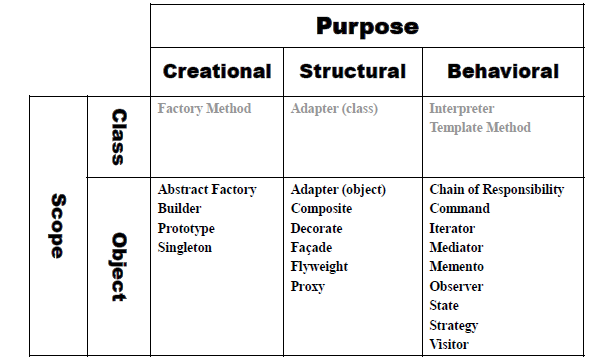

# 01. 디자인 패턴에 대해 알아봅시다.

## 디자인 패턴이 생겨난 이유

- 소프트웨어를 재상용할 수 있고, 유연하고, 확장성 있고, 유지보수가 용이하게 만드는 것은 매우 어려운 일임

- 기술, 재능, 노력, 창의성, 직관력 등등이 필요하지만, 무엇보다 경험이 중요

- **What is a Design Pattern**

 Each pattern describes a **problem** which occurs over and over again in our environment, 
 and then describes the core of the **solution** to that problem, in such a way 
 that you can use this solution a million times over, without ever doing it the same time twice.”
 
 -- Christopher Alexander

- 성공적인 설계라는 것은 존재함

- GoF( Gang of Four) 네 명의 학자가 기존의 많은 사례와 시스템등을 분석하여 **좋은 설계라는 이런것이다** 라는 23개 패턴을 제안

- 객체 지향 프로그래밍에 적용할 수 있는 예시를 제공

- 디자인 패턴 분류

## 디자인 패턴은 규칙이 아닙니다

- 언어에 종속적이지 않음

- 프레임 워크 개발에 적용될 수 있음

- 특정 영역에 종속적이지 않고 일반적으로 활용할 수 있음

- 좋은 설계에 대한 제안

## 그럼에도 배워야할 이유

- 객체 지향을 위한 디자인 패턴은 소프트웨에의 중요한 요소를 향상 시킴

  -- resuse, flexibility, extensibility, modularity

- 디자인 패턴을 사용하면 소프트웨어 개발의 communication에 도움이 됨

- 좋은 설계는 좋은 소프트웨어나 오픈소스에 대해 학습하거나, 많은 경험과 연습에 의해 훈련될 수 있기에 

 디자인 패턴을 공부함으로써 이미 증명된 스킬과 경험을 배울수 있음

- 높은 결합도를 가지거나 알고리즘 종속성, 객체의 표현이나 구현에 종속적으로 구현된 소프트웨어의 리펙토링을 가능하게 함

- 결국 좋은 설계를 유도하여 소프트웨어의 유지보수에 들어가는 비용을 절약할 수 있음
