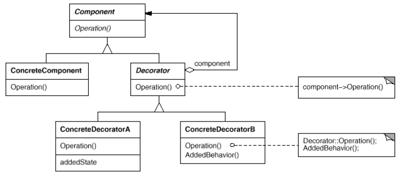
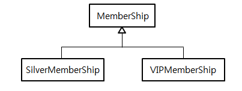
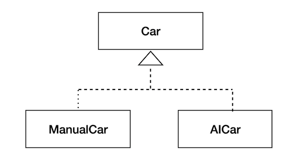

# 04. 클래스 다이어그램 

- 객체 지향 프로그래밍에서 여러 클래스 상호관의 혐력 관계를 나타내는 Diagram

- 클래스 간의 관계를 설계 할때 유용함



## 연관 관계 (association)

- 클래스 상호 간에 서로 연관되어 있음을 나타냄

- 단방향 연관관계의 경우는 화살표(->)로 표시한다.

- 양방향 연관관계는 직선(-)으로 표시한다.

- 클래스간의 연관된 개체의 수를 표현해야 하는 경우에는 선의 끝쪽에 다중성(multiplicity)를 나타낸다.

```
public class Student {
	
	int studentID;
	String studentName;
	ArrayList<Subject> subjectList;

```


## 집합 관계 (composition, aggregation)

- 연관관계의 특별한 경우

- 클래스간의 포함관계를 나타냄

- 전체 객체와 부분 객체의 인스턴스 생존 주기( life time ) 에 따라 두가지로 구분할 수 있음

**집약 관계**

- 클래스 다이어그램에 빈 마름모로 표시

- 전체 객체와 부분 객체의 라이프 타임이 독립적 즉, 포함하는 객체(전체 객체)가 사라져도 포함된 객체 (부분 객체)는 사라지지 않음

- 공유하는 리소스가 해당됨

- 전체 객체가 생성될 때 매개 변수로 전달 받음

**합성 관계**

- 클래스 다이어그램에 채워진 마름모로 표시 

- 전체 객체의 라이프 타임에 부분객체가 종속됨. 전체 객체가 사라지면 부분 객체도 사라짐

- 주로 멤버 변수로 선언하여 사용

- 전체 객체의 생성자에서 부분 객체를 생성함

## 의존 관계 (dependency)

- 연관 관계 보다는 짧은 life time

- 프로그램 내에서는 참조 변수가 매개변수나 지역 변수로 구현

```
class Student {

    int money;
...
    public void takeBus(Bus bus) {
		  bus.take(1000);
		  this.money -= 1000;
		  
	 }
	    
	public void takeSubway(Subway subway) {
		  subway.take(1500);
		  this.money -= 1500;
	 }
}
```


## 일반화 관계 (generalization)

- 객체 지향에서 상속을 표현할 때

- 일반적인 클래스(상위 클래스)를 보다 구체적인 클래스(하위 클래스)가 상속함



## 실체화 관계 ( realization )

- 기능이 선언된 인터페이스를 구현하는 클래스는 선언된 기능을 구현할 책임이 있음

- 여러 클래스가 하나의 인터페이스를 구현함으로써 다형성을 제공함



## 접근 제어자 표시


| 접근제어자 | 표시 | 설명 |
| ------ | ------ |------ |
| public | + | 내부, 외부 모드 접근 가능 |
| protected | * | 같은 패키지나 상속관계의 클래스만 접근 가능 |
| default | ~ | 같은 패키지만 접근 가능 |
| private | - | 같은 클래스 내부에서만 접근 가능 |
