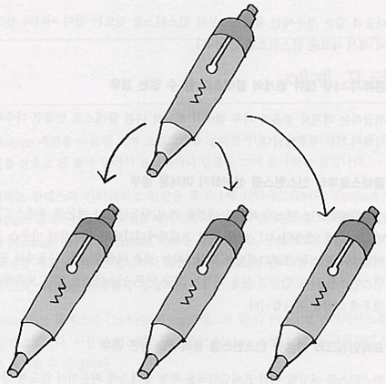

# Prototype Pattern

## 1. Prototype Pattern 이란?

- 복제해서 인스턴스를 만드는 패턴



## 2. 의도 (Intent)와 동기(Motivation)

-  클래스의 인스턴스가 생성과정이 복잡하거나 여러 조합에 의해 생성되어야 하는경우 하나의 견본(prototype)을 만들어 

   초기화해두고 이를 복제해서 객체를 생성하는 방법 


## 3. Class diagram


## 4. 객체 협력 (collaborations)

- 복제하는데 필요한 

## 5. 중요한 결론 (consequence)

- 프로토타입 속성값을 활용하여 다양한 객체를 생성할 수 있음

- 서브클래스의 수를 줄일 수 있다. 

- 자바에서는 clone() 메서드를 재정의하여 구현한다.

## 6. 예제 

```
package prototype;

import java.util.ArrayList;

class Book{
	private String author;
	private String title;
	
	public Book(String author, String title) {
		this.author = author;
		this.title = title;
	}
	
	public String getAuthor() {
		return author;
	}
	
	public void setAuthor(String author) {
		this.author = author;
	}
	
	public String getTitle() {
		return title;
	}
	
	public void setTitle(String title) {
		this.title = title;
	}

	public String toString() {
		return title + "," + author;
	}
}


class BookShelf implements Cloneable{
	
	private ArrayList<Book> shelf;
	
	public BookShelf() {
		shelf = new ArrayList<Book>();
	} 
	
	public void addBook(Book book) {
		shelf.add(book);
	}

	@Override
	protected Object clone() throws CloneNotSupportedException {

		BookShelf another = new BookShelf();
		for(Book book : shelf) {
			
			another.addBook(new Book(book.getAuthor(), book.getTitle()));
		}
		
		return another;
	}
	
	public ArrayList<Book> getShelf() {
		return shelf;
	}

	public void setShelf(ArrayList<Book> shelf) {
		this.shelf = shelf;
	}

	public String toString() {
		return shelf.toString();
	}
	
	
}

public class PrototypeTest {

	public static void main(String[] args) throws CloneNotSupportedException {

		BookShelf bookShelf = new BookShelf();
		
		bookShelf.addBook(new Book("orange", "Tomas"));
		bookShelf.addBook(new Book("apple", "James"));
		bookShelf.addBook(new Book("grape", "Edward"));
		
		
		BookShelf another = (BookShelf)bookShelf.clone();
		
		System.out.println(bookShelf);
		System.out.println(another);
		
		bookShelf.getShelf().get(0).setAuthor("Mango");
		bookShelf.getShelf().get(0).setTitle("Jane");
		
		System.out.println(bookShelf);
		System.out.println(another);
	}

}
```

