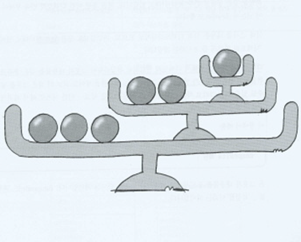
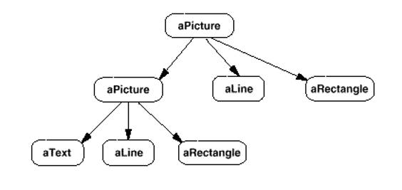
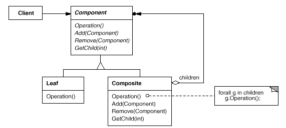

# Composite Pattern

## 1. Composite Pattern 이란?

- 그릇과 내용물을 동일시



## 2. 의도 (Intent)와 동기(Motivation)

- 부분과 전체에 대한 복합 객체의 트리구조를 나타낼 수 있음

- 클라이언트가 개별 객체와 복합 객체를 동일하게 다룰 수 있는 인터페이스를 제공 

- 재귀적인 구조 



## 3. Class diagram




## 4. 객체 협력 (collaborations)

- **Component**

   -- 전체와 부분 객체에서 공통적으로 사용할 인터페이스 선언

   -- 전체와 부분 객체에서 공통으로 사용할 기능 구현

   -- 전체 클래스가 부분요소들을 관리하기 위해 필요한 인터페이스 선언

- **Leaf**:

   -- 집합 관계에서 다른 객체를 포함할 수는 없고 포함되기만 하는 객체로 가장 기본이 되는 기능을 구현

- **Composite**:

  -- 여러 객체를 포함하는 복합 객체에 대한 기능 구현

  -- 포함한 여러 객체를 저장하고 관리하는 기능을 구현

- **Client**: 
 
  -- Component에 선언된 인터페이스를 통하여 부분과 전체를 동일하게 처리

## 5. 중요한 결론 (consequence)

- 기본 객체는 복합 객체에 포함이 되고, 복합 객체 역시 또 다른 복합 객체에 포함될 수 있다.

- 클라이언트 코드는 기본객체와 복합객체에 대한 일관된 프로그래밍을 할 수 있다.

- 기본 객체가 증가하여도 전체 객체의 코드에 영향을 주지 않는다.

- 새로운 요소의 추가가 편리하고 범용성 있는 설계가 가능하다.

## 6. 예제 

- 제품의 카테고리와 제품의 계층구조를 Composite Pattern 으로 구현 

ProductCategory.java
```
public abstract class ProductCategory {

	int id;
	String name;
	int price;
	
	public ProductCategory(int id, String name, int price) {
		this.id = id;
		this.name = name;
		this.price = price;
	}
	
	public abstract void addProduct(ProductCategory product);
	public abstract void removeProduct(ProductCategory product);
	public abstract int getCount();
	public abstract String getName();
	public abstract int getPrice();
	public abstract int getId();
	
}
```
Product.java
```
public class Product extends ProductCategory{

	@Override
	public int getCount() {
		return 1;
	}

	@Override
	public String getName() {
		return name;
	}

	@Override
	public int getPrice() {
		return price;
	}

	@Override
	public int getId() {
		return id;
	}
	
	public Product(int id, String name, int price) {
		super(id, name, price);
	}

	@Override
	public void addProduct(ProductCategory product) {
		
	}

	@Override
	public void removeProduct(ProductCategory product) {
		
	}

}
```
Category.java
```
public class Category extends ProductCategory{
	

	ArrayList<ProductCategory> list;
	
	public Category(int id, String name, int price) {
		super(id, name, price);
		list = new ArrayList<ProductCategory>();
	}
	
	@Override
	public void addProduct(ProductCategory productCategory) {
		list.add(productCategory);
	}

	@Override
	public void removeProduct(ProductCategory productCategory) {
		
		for(ProductCategory temp : list) {
			if(temp.getId() == productCategory.getId()) {
				list.remove(temp);
				return;
			}
		}
		System.out.println("카테고리가 없습니다.");
	}

	@Override
	public int getCount() {
		int count = 0;
		
		for(ProductCategory temp : list) {
			count += temp.getCount(); 
		}	
		return count;
	}

	@Override
	public String getName() {
		return list.toString();
	}

	@Override
	public int getPrice() {
		int price = 0;
		
		for(ProductCategory temp : list) {
			price += temp.getPrice(); 
		}
		
		return price;
	}

	@Override
	public int getId() {
		return 0;
	}
}
```
CategoryClient.java
```
public class CategoryClient {

	public static void main(String[] args) {

		ProductCategory womanCategory = new Category(1234, "Woman", 0);
		ProductCategory manCategory = new Category(5678, "Man", 0);
		
		ProductCategory clothesCategoryW = new Category(2345, "Clothes", 0);
		ProductCategory bagCategoryW = new Category(3456, "Bag", 0);
		ProductCategory shoesCategoryW = new Category(9876, "Shoes", 0);
		
		womanCategory.addProduct(clothesCategoryW);
		womanCategory.addProduct(bagCategoryW);
		womanCategory.addProduct(shoesCategoryW);
		
		ProductCategory clothesCategoryM = new Category(23450, "Clothes", 0);
		ProductCategory bagCategoryM = new Category(34560, "Bag", 0);
		ProductCategory shoesCategoryM = new Category(98760, "Shoes", 0);
		
		manCategory.addProduct(clothesCategoryM);
		manCategory.addProduct(bagCategoryM);
		manCategory.addProduct(shoesCategoryM);
		
		ProductCategory shoes1 = new Product(121, "Nike", 100000);
		ProductCategory shoes2 = new Product(122, "ADIDAS", 200000);
		ProductCategory shoes3 = new Product(123, "GUCCI", 300000);
		ProductCategory shoes4 = new Product(124, "BALENCIA", 400000);
		ProductCategory shoes5 = new Product(125, "PRADA", 500000);
		ProductCategory shoes6 = new Product(126, "BALLY", 600000);
		
		shoesCategoryW.addProduct(shoes1);
		shoesCategoryW.addProduct(shoes2);
		shoesCategoryW.addProduct(shoes3);
		
		shoesCategoryM.addProduct(shoes4);
		shoesCategoryM.addProduct(shoes5);
		shoesCategoryM.addProduct(shoes6);
		
		
		ProductCategory bag1 = new Product(121, "HERMES", 500000);
		ProductCategory bag2 = new Product(122, "LOUISVUITTON", 500000);
		ProductCategory bag3 = new Product(123, "GUCCI", 500000);
		ProductCategory bag4 = new Product(124, "BALENCIA", 500000);
		ProductCategory bag5 = new Product(125, "PRADA", 500000);
		ProductCategory bag6 = new Product(126, "MULBERRY", 500000);
		
		bagCategoryW.addProduct(bag1);
		bagCategoryW.addProduct(bag2);
		bagCategoryW.addProduct(bag3);
		
		bagCategoryM.addProduct(bag4);
		bagCategoryM.addProduct(bag5);
		bagCategoryM.addProduct(bag6);
		
		System.out.println(womanCategory.getCount());
		System.out.println(womanCategory.getPrice());
		System.out.println(manCategory.getCount());
		System.out.println(manCategory.getPrice());
	
	}

}
```

