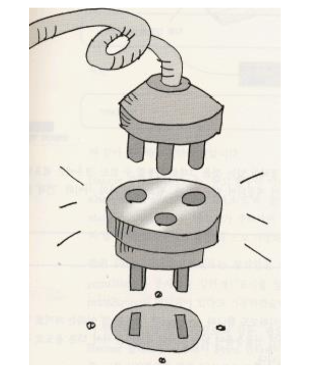
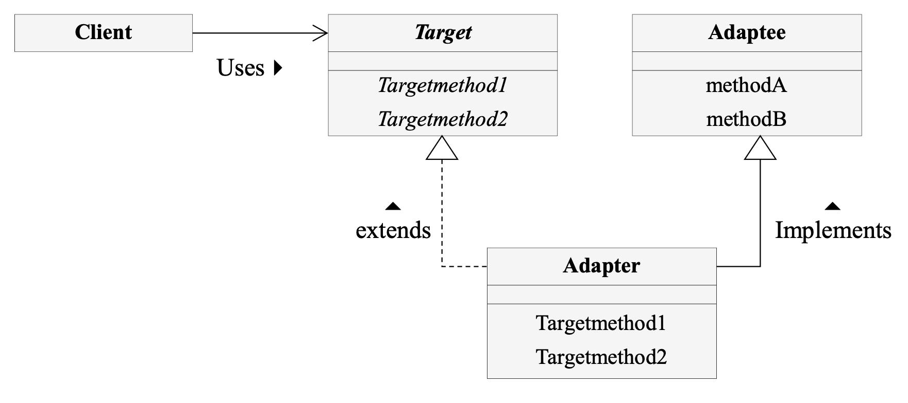
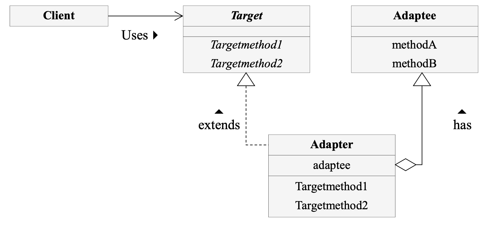

# Adapter Pattern

## 1. Adpter Pattern 이란?

- 서로 다른 인터페이스를 중간에서 연결해주는 기능

- 이미 사용중이거나 정의된 인터페이스들을 중간에서 맞춰서 적용해 줄 수 있음 

- 예) 안드로이드 ListView Adpter 



## 2. 의도 (Intent)와 동기(Motivation)

- 클라이언트에서 사용하던 방식대로 호출하여 사용할 수 있도록 조정해주는 기능

- 서로 일치하지 않는 인터페이스를 변경하지 않고 중간에서 호출하여 사용할 수 있도록 제공

- Wrapper

## 3. 해결 방법 (Solution)

- 상속을 활용하여 구현하는 Adapter

- 객체 합성의 방법으로 구현하는 Adapter 

## 4. Class diagram

- 상속 방법




- 합성 방법




## 5. 객체 협력 (collaborations)

- **Target** : 클라이언트가 사용할 인터페이스를 정의 하고 있는 클래스 

- **Client** : Target 인터페이스를 사용하는 객체 

- **Adaptee** : 실제의 새롭거나 적용될 기능이 제공되는 클래스

- **Adapter** : Target 인터페이스에 Adaptee의 인터페이스를 맞춰주는 클래스


## 6. 중요한 결론 (consequence)

-  Adpter를 사용함으로써 클라이언트가 사용하는 방식은 동일하면서 여러 기능이 제공될 수 있다.

- 예를 들어 안드로이드에서는 여러 View (ListView 나 GridView)를 구현할 때 이에 대한 Item들을 직접 View에 올리지 않고, Adapter를 이용하여 Adapter에서 Item을 관리하고 그리는 방식을 정하도록 한다. <br>
  이 방법은 실제 보여주는 부분과 데이타를 분리하여 데이타가 다양한 방식의 View에 활용될 수 있고, 이 때 중간에서 사용되는 여러 Adapter (BaseAdapter, ListAdapter)등이 데이터와 View를 연결해준다.


## 7. 예제 


Print.java ( Target )
```
public interface Print {
    public abstract void printWeak();
    public abstract void printStrong();
}
```


Banner.java (Adptee)
```
public class Banner {
    private String string;
    public Banner(String string) {
        this.string = string;
    }
    public void showWithParen() {
        System.out.println("(" + string + ")");
    }
    public void showWithAster() {
        System.out.println("*" + string + "*");
    }
}
```

PrintBanner.java (Adapter)
```
public class PrintBanner implements Print {
    private Banner banner;  //Composition
    public PrintBanner(String string) {
        this.banner = new Banner(string);
    }
    public void printWeak() {
        banner.showWithParen();
    }
    public void printStrong() {
        banner.showWithAster();
    }
}
```

Main.java
```
public class Main {
    public static void main(String[] args) {
        Print p = new PrintBanner("Hello");
        p.printWeak(); 
        p.printStrong();
    }
}
```

Adnroid 간단한 예제
```
protected void onCreate(Bundle savedInstanceState) {
        super.onCreate(savedInstanceState);
        setContentView(R.layout.activity_main);
 
        ListView listview = (ListView)findViewById(R.id.listview);
        selected_item_textview = (TextView)findViewById(R.id.selected_item_textview);
 
 
        
        List<String> list = new ArrayList<>();  //데이터 저장용
 
        
        ArrayAdapter<String> adapter = new ArrayAdapter<>(this,
                android.R.layout.simple_list_item_1, list);  //마지막 인자로 list
 
                listview.setAdapter(adapter);  //adapter지정
 
        listview.setOnItemClickListener(new AdapterView.OnItemClickListener() {
 
            @Override
            public void onItemClick(AdapterView<?> adapterView,
                                    View view, int position, long id) {
 
                String selected_item = (String)adapterView.getItemAtPosition(position);
                selected_item_textview.setText(selected_item);
            }
        });
         
        list.add("사과");
        list.add("배");
        list.add("귤");
        list.add("바나나");
      
    }
```
