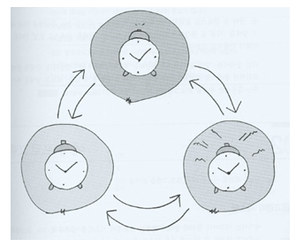
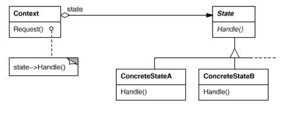

# State Pattern

## 1. State Pattern 이란?

- 클래스가 하나의 상태에 따라 그 내부의 여러 메서드의 기능이 바뀐다고 하면 이를 각각의 클래스로 분리한다.

## 2. 의도 (Intent)와 동기(Motivation)

- 객체의 기능은 상태에 따라 달라질 수 있는데, 이러한 상태가 여러가지이고, 클래스 전반의 모든 기능이 상태에 의존적이라 하면, 상태를 클래스로 표현하는 것이 적절함
   
- 클래스로 분리하지 않게 되면 상태가 여러가지인 경우 많은 if-else 문이 사용되고 추후 상태가 추가되거나 삭제될 때 수정해야 하는 사항이 너무 많아짐

## 3. Class diagram

## 4. 객체 협력 (collaborations)

- Context  : ConcreteState의 인스턴스를 관리하고 서로 상태가 바뀌는 순간을 구현할 수 있다.

- State : Context 가 사용할 메서드를 선언한다.

- ConcreateState : 각 상태 클래스가 수행할 State에 선언된 메서드를 구현한다.
  

## 5. 중요한 결론 (consequence)

- 상태에 따른 기능을 분리하여 구현

- 새로운 상태가 추가되면 새로운 클래스를 추가한다.

- 각 상태의 switch를 명확하게 구현해 함 

## 6. 예제 

- template method 예제를 다시 봅시다
