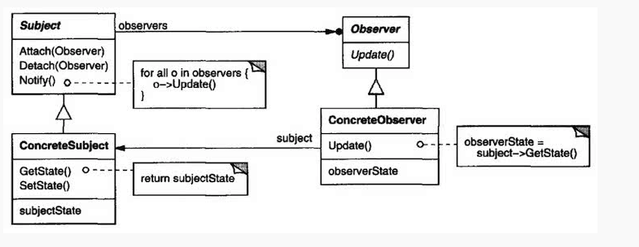

# Observer Pattern

## 1. Observer Pattern 이란?

- 객체 사이에 일대다의 의존 관계가 있고, 어떤 객체의 상태변하게 되면 그 객체에 의존성을 가진 다른 객체들이 변화의 통지(notify or update)를 받고 자동으로 갱신될 수 있게 함

- dependent, publish-subscribe


## 2. 의도 (Intent)와 동기(Motivation)

- 하나의 객체에 연동되는 여러 객체 집합이 있을 때 변화에 대한 일관성은 유지하고, 객체간의 결합도는 낮게하기 위한 패턴

- 변화에 관심이 있는 객체에 대한 가정없이 통보될 수 있도록 해야 함

- 주로 data - view 의 관계에서 사용됨

- log와 그 handler들의 관계. (file, console, 등등)

## 3. Class diagram




## 4. 객체 협력 (collaborations)

- **Subject** : Observer를 알고 있는 주체, Observer를 더하거나 뺄수 있음

- **Observer** : Subject의 변화에 관심을 가지는 객체, 갱신에 필요한 인터페이스 정의, 객체들의 일관성을 유지

- **ConcreteSubject** : ConcreteObserver에게 알려주어야하는 상태가 변경될때 통보 (주로 List로 Observer관리)

- **ConcreteObserver** : 객체에 대한 참조자를 관리하고, Subject의 일관성 유지하며, Subject가 변경될 때 갱신되는 인터페이스 구현


## 5. 중요한 결론 (consequence)

- Subject와 Observer간의 추상적인 결합만의 존재

- BroadCast 방식의 교류가 가능

- 데이타와 그 뷰 사이에 자주 사용되는 방법

## 6. 예제 

Observer.java
```
public interface Observer {
    public abstract void update(NumberGenerator generator);
}
```

NumberGenerator.java
```
public abstract class NumberGenerator {
    private List<Observer> observers = new ArrayList<Observer>();        // Observer들을 보관
    public void addObserver(Observer observer) {    // Observer를 추가
        observers.add(observer);
    }
    public void deleteObserver(Observer observer) { // Observer를 삭제
        observers.remove(observer);
    }
    public void notifyObservers() {               // Observer에 통지
        Iterator<Observer> it = observers.iterator();
        while (it.hasNext()) {
            Observer o = it.next();
            o.update(this);
        }
    }
    public abstract int getNumber();                // 수를 취득한다.
    public abstract void execute();                 // 수를 생성한다.
}
```

RandomNumberGenerator.java
```
public class RandomNumberGenerator extends NumberGenerator {
    private Random random = new Random();   // 난수발생기
    private int number;                     // 현재의 수
    public int getNumber() {                // 수를 취득한다.
        return number;
    }
    public void execute() {
        for (int i = 0; i < 20; i++) {
            number = random.nextInt(50);
            notifyObservers();
        }
    }
}
```

DigitObserver.java
```
public class DigitObserver implements Observer {
    public void update(NumberGenerator generator) {
        System.out.println("DigitObserver:" + generator.getNumber());
        try {
            Thread.sleep(100);
        } catch (InterruptedException e) {
        }
    }
}
```

GraphObserver.java
```
public class GraphObserver implements Observer {
    public void update(NumberGenerator generator) {
        System.out.print("GraphObserver:");
        int count = generator.getNumber();
        for (int i = 0; i < count; i++) {
            System.out.print("*");
        }
        System.out.println("");
        try {
            Thread.sleep(100);
        } catch (InterruptedException e) {
        }
    }
}
```

Main.java
```
public class Main {
    public static void main(String[] args) {
        NumberGenerator generator = new RandomNumberGenerator();
        Observer observer1 = new DigitObserver();
        Observer observer2 = new GraphObserver();
        generator.addObserver(observer1);
        generator.addObserver(observer2);
        generator.execute();
    }
}
```


