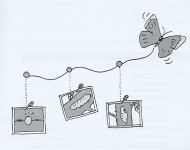
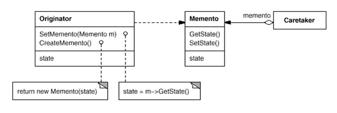

# Memento Pattern

## 1. Memento Pattern 이란?

- 내부 상태를 객체화하여, 나중에 객체가 이 상태로 복구 가능하게 함

- 인스턴스의 상태를 보존해 두었다가 보존해 둔 정보를 가지고 인스턴스를 원래 상태로 복원

- 인스턴스를 복원하기 위해서는 내부 정보에 자유롭게 접근 가능해야 함

- 캡슐화가 파괴가 일어나지 않도록 주의해야 함



## 2. 의도 (Intent)와 동기(Motivation)

- 이전의 상태로 되돌리는 undo

- 했던 작업을 다시 하는 redo

- 기억해야 하는 순간을 저장하는 객체

- 오류를 복구하거나 수행 결과를 취소하기 위한 작업에 사용

## 3. Class diagram




## 4. 객체 협력 (collaborations)

- **Memento** : Originator 객체의 내부 상태를 필요한 만큼 저장한다. Originator만이 Memento에 접근할 수 있다.

- **Originator** : Memento를 생성하여 현재 객체의 상태를 저장하고 내부 상태를 복구

- **CareTaker (undo mechanism)** : Memento의 보관을 책임지기는 하지만, memento의 내부를 확인할 수 없음


## 5. 중요한 결론 (consequence)

- 복잡한 Originator 클래스의 내부 상태를 다른 객체로 분리함으로써 상태에 대한 캡슐화를 보장할 수 있다

- 복구에 필요한 (클라이언트가 요구하는) 상태만 따로 관리함으로써, Originator 내부에서 저장하지 않고 Originator가 단순해질수 있다.

- Memento의 사용에 오버헤드가 발생할 수 있다.

## 6. 예제 

Main.java
```
public class Main {
    public static void main(String[] args) {
        Gamer gamer = new Gamer(100);               // 처음의 돈은 100
        Memento memento = gamer.createMemento();    // 처음의 상태를 보존해 둔다.
        ArrayList<Memento> history = new ArrayList<Memento>();
        for (int i = 0; i < 100; i++) {
            System.out.println("==== " + i);        // 횟수 표시
            System.out.println("현 상태:" + gamer);    // 현재의 주인공의 상태 표시

            gamer.bet();    // 게임을 진행 시킨다.

            System.out.println("돈은" + gamer.getMoney() + "원이 되었습니다.");

            // Memento의 취급 결정
            if (gamer.getMoney() > memento.getMoney()) {
                System.out.println("    (많이 증가했으니 현재의 상태를 보존해두자)");
                memento = gamer.createMemento();
                history.add(memento);
            } else if (gamer.getMoney() < memento.getMoney() / 2) {
                System.out.println("    (많이 줄었으니 이전의 상태로 복귀하자)");
                gamer.restoreMemento(memento);
                
            }

            // 시간을 기다림
            try {
                Thread.sleep(1000);
            } catch (InterruptedException e) {
            }
            System.out.println("");
        }
    }
}
```

Gamer.java
```
String> it = fruits.iterator();
        while (it.hasNext()) {
            String f = it.next();
            if (f.startsWith("good~ ")) {         // 과일은 맛있는 것만 보존
                m.addFruit(f);
            }
        }
        return m;
    }
    public void restoreMemento(Memento memento) {       // undo를 실행한다.
        this.money = memento.money;
        this.fruits = memento.fruits;
    }
    public String toString() {                      // 문자열 표현
        return "[money = " + money + ", fruits = " + fruits + "]";
    }
    private String getFruit() {                     // 과일을 1개 얻는다.
        String prefix = "";
        if (random.nextBoolean()) {
            prefix = "good~ ";
        }
        return prefix + fruitsname[random.nextInt(fruitsname.length)];
    }
}
```

Memento.java
```
public class Memento {
    int money;                              // 돈
    ArrayList<String> fruits;                          // 과일
    public int getMoney() {                 // 돈을 얻는다.(narrow interface)
        return money;
    }
    Memento(int money) {                    // 생성자(wide interface)
        this.money = money;
        this.fruits = new ArrayList<String>();
    }
    void addFruit(String fruit) {           // 과일을 추가한다.(wide interface)
        fruits.add(fruit);
    }
}
```


